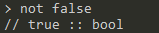
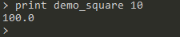
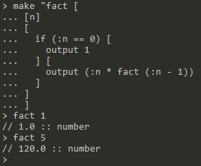

# MUA解释器

`任皓天  3150104714@zju.edu.cn  Haotian_Ren@outlook.com`

### Contents

[解释器实现内容](#mua解释器的实现内容)

[操作实现方法](#操作实现方法)

[Error处理](error处理)

[MUA代码样例](#mua代码样例)

[源代码结构](#源代码结构)

## MUA(Make Up Programming Language)

### 基本数据类型

数字`number`，字`word`，表`list`，布尔`bool`

- 数字的字面量以`[0~9]`或`'-'`开头，不区分整数，浮点数
- 字的字面量以双引号`"`开头，不含空格，采用Unicode编码。在`"`后的任何内容，直到空格（包括空格、tab和回车）为止的字符都是这个字的一部分，包括其中可能有的`"`和`[]`等符号
- 表的字面量以方括号`[]`包含，其中的元素以空格分隔；元素可是任意类型；元素类型可不一致

### 基本操作

基本形式：操作名 参数

操作名是一个不含空格的词，与参数间以空格分隔。参数可以有多个，多个参数间以空格分隔。每个操作所需的参数数量是确定的，所以不需要括号或语句结束符号。有的操作有返回值，有的没有。

一个程序就是操作的序列。

基本操作有：

- `//`：注释
- `make <word> <value>`： 将value绑定到word上。基本操作的字不能用做这里的word。绑定后的word称作名字，位于命名空间。
- `thing <word>`：返回word所绑定的值
- `:<word>`：与thing相同
- `erase <word>`：清除word所绑定的值
- `isname <word>`：返回word是否是一个名字，true/false
- `print <value>`：输出value
- `read`：返回一个从标准输入读取的数字或字
- `readlinst`：返回一个从标准输入读取的一行，构成一个表，行中每个以空格分隔的部分是list的一个元素
- 运算符operator
  - `add`, `sub`, `mul`, `div`, `mod`：`<operator> <number> <number>`
  - `eq`, `gt`, `lt`：`<operator> <number|word> <number|word>`
  - `and`, `or`：`<operator> <bool> <bool>`
  - `not`：`not <bool>`
- `repeat <number> <list>`：运行list中的代码number次

### 函数定义和调用

#### 定义

```
	make <word> [<list1> <list2>]
		word为函数名
		list1为参数表
		list2为操作表
```

#### 调用

```
	<functionName> <arglist>
		<functionName>为make中定义的函数名，不需要双引号"
		<arglist>是参数表，<arglist>中的值和函数定义时的<list1>中名字进行一一对应绑定
```

#### 函数相关的操作

- `output <value>`：设定value为返回给调用者的值，但是不停止执行
- `stop`：停止执行
- `export`：将本地make的值输出到全局

### 表达式计算

允许使用以下运算符对数字进行计算：

```
+-*/%()
```

为了方便识别，解释器的实现可以要求表达式的外面有括号包围。

****

- `random <number>`：返回[0,number)的一个随机数
- `sqrt <number>`：返回number的平方根
- `isnumber <value>`：返回value是否是数字 
- `isword <value>`：返回value是否是字
- `islist <value>`：返回value是否是表 
- `isbool <value>`：返回value是否是布尔量 
- `isempty <word|list>`: 返回word或list是否是空
- `int <number>`: floor the int
- `word <word> <word|number|bool>`：将两个word合并为一个word，第二个值可以是word、number或bool
- `if <bool> <list1> <list2>`：如果bool为真，则执行list1，否则执行list2。list均可以为空表
- `sentence <list1> <list2>`：将list1和list2合并成一个表，两个表的元素并列，list1的在list2的前面
- `list <value1> <value2>`：将两个值合并为一个表，如果值为表，则不打开这个表
- `join <list> <value>`：将value作为list的最后一个元素加入到list中（如果value是表，则整个value成为表的最后一个元素）
- `first <word|list>`：返回word的第一个字符，或list的第一个元素
- `last <word|list>`：返回word的最后一个字符，list的最后一个元素
- `butfirst <word|list>`：返回除第一个元素外剩下的表，或除第一个字符外剩下的字
- `butlast <word|list>`：返回除最后一个元素外剩下的表，或除最后一个字符外剩下的字
- `stop`：停止当前代码的执行。当前代码可能是run、repeat、if或函数中的代码
- `wait <number>`：等待number个ms
- `save <word>`：保存当前命名空间在word文件中
- `load <word>`：从word文件中装载内容，加入当前命名空间
- `erall`：清除当前命名空间的全部内容
- `poall`：列出当前命名空间的全部名字

### 既有名字

系统提供了一些常用的量，或可以由其他操作实现但是常用的操作，作为固有的名字。这些名字是可以被删除（erase）的。

- `pi`：3.14159
- `run <list>`：运行list中的代码

## MUA解释器的实现内容

### 第一部分实现内容集合

#### 基本数据类型

- 数字`number`：字面量使用数字的通用表示方法

  

- 单词`word`：字面量以西文双引号`"`开头，以空白字符结尾，西文双引号到空白字符之间的字符串为单词的真实值

  

- 布尔`bool`：字面量为`true`和`false`

  

- 列表`list`：字面量`[`开头，以`]`结尾，列表中的元素可以为任意类型，以空白符作为间隔符

  

  由于列表在被直接释放到解释器时会被执行，所以采用print的方式进行输出演示。

#### 基本操作

- `make <word> <value>`： 将value绑定到word上。基本操作的单词不能用做这里的word。绑定后的word称作名字，位于命名空间。

  

- `thing <word>`：返回word所绑定的值

  

- `:<word>`：与`thing <word>`相同

  

  事实上在具体实现中，`:`操作为`thing`操作得语法糖，可以通过以下过程进行体现：

  

- `erase <word>`：清除word所绑定的值

  

- `isname <word>`：返回word是否是一个名字，true/false

  

- `print <value>`：输出value

  

- `read`：返回一个从标准输入读取的数字或单词

  

- `readlist`：返回一个从标准输入读取的一行，构成一个列表，行中每个以空格分隔的部分是list的一个元素

  

- 运算符operator
  - `add`, `sub`, `mul`, `div`, `mod`：`<operator> <number> <number>`

    

  - `eq`：`<operator> <number|word|list> <number|word|list>`

    

  - `gt`, `lt`：`<operator> <number|word> <number|word>`

    

  - `and`, `or`：`<operator> <bool> <bool>`

    

  - `not`：`not <bool>`

    

### 第二部分实现内容集合

#### 函数定义和调用

- 函数定义

```
make <word> [<list1> <list2>]
	word为函数名
	list1为参数列表
	list2为操作列表
```

演示：


如上图所示便完成了一个函数`another_print`的创建，通过`print`操作我们可以看出函数实际上使用`word`与一个具有函数格式的`list`绑定进行存储。

- 调用

```
<functionName> <arglist>
	<functionName>为make中定义的函数名，不需要双引号"
	<arglist>是参数列表，<arglist>中的值和函数定义时的<list1>中名字进行一一对应绑定
```

演示：


- 函数相关的操作
  - `output <value>`：设定value为返回给调用者的值，但是不停止执行

    演示：

    

  - `export <word>`：将word及word所绑定的值从当前所执行函数的命名空间导出到全局命名空间

    演示：

    

  - `stop`：停止函数执行

    演示：

    

#### 表达式计算

表达式以西文左圆括号开始，以西文右圆括号结束，使用中缀运算符用于进行number类型以及bool类型的计算，要求中缀运算符的左右使用空白符进行间隔。

- number类型可以应用两种类型的中缀运算符：
  - 返回值为number类型的运算符：`+` `-` `*` `/` `%`

    演示：

    

  - 返回值为bool类型的运算符：`>` `<` `==`

    演示：

    

- bool类型可以应用的中缀运算符返回值均为bool类型，包括：`&&` `||`

  演示：

  

#### `repeat`操作

`repeat <number> <list>`：运行list中的代码[number]次

演示：


### 第三部分实现内容集合

#### `if`操作

`if <bool> <list1> <list2>`：如果bool为真，则执行list1，否则执行list2。


#### `number`相关操作

- `random <number>`：返回[0,number)的一个随机数

  

- `sqrt <number>`：返回number的平方根

  

- `int <number>`: floor the int

  

#### `word`及`list`相关操作

- `word <word> <word|number|bool>`：将两个word合并为一个word，第二个值可以是word、number或bool

  

- `list <value1> <value2>`：将两个值合并为一个表，如果值为表，则不打开这个表

  

- `sentence <list1> <list2>`：将list1和list2合并成一个表，两个表的元素并列，list1的在list2的前面

  

  为`sentence`操作实现了中缀运算形式，类比Haskell使用`++`运算符：

  

- `join <list> <value>`：将value作为list的最后一个元素加入到list中（如果value是表，则整个value成为表的最后一个元素）

  

- `first <word|list>`：返回word的第一个字符，或list的第一个元素

- `last <word|list>`：返回word的最后一个字符，list的最后一个元素

  

- `butfirst <word|list>`：返回除第一个元素外剩下的表，或除第一个字符外剩下的字

- `butlast <word|list>`：返回除最后一个元素外剩下的表，或除最后一个字符外剩下的字

  

- `isempty <word|list>`: 返回word或list是否是空

  

#### 命名空间相关操作

- `save <word>`：保存当前命名空间在word文件中
- `load <word>`：从word文件中装载内容，加入当前命名空间
- `erall`：清除当前命名空间的全部内容
- `poall`：列出当前命名空间的全部名字


以以上为例，首先使用`poall`可以看出当前命名空间存在`pi`和`run`两个名字绑定，我们使用`save`将其保存到文件`space`中然后使用`erall`清空当前命名空间，再次`poall`便无输出，随后使用`load`从`space`文件中重新加载命名空间，`poall`便可以重新看到加载回的`pi`和`run`。


通过以上操作可以看出`load`操作的**加载**而非覆盖方式，即其不会影响到原有的命名空间。

若尝试从一个不存在的文件中读取则会报错，如下：


#### 类型判断操作

- `isnumber <value>`：返回value是否是数字
- `isword <value>`：返回value是否是字
- `islist <value>`：返回value是否是表
- `isbool <value>`：返回value是否是布尔量


#### `wait`操作

`wait <number>`：等待number个ms

如下图所示，即每1s输出一次“-1s”，代表时间流逝了1s：


运行到一半时，如上图，5s后运行结束如下图：


#### 既有名字

系统提供了一些常用的量，或可以由其他操作实现但是常用的操作，作为固有的名字。这些名字是可以被删除（erase）的。

- `pi`：3.14159
- `run <list>`：运行list中的代码


## 操作实现方法

### 基本数据类型

在`mua`包中的`Data.java`文件中定义了MUA中的基本数据类型：

```java
class Data {
	public enum Type {
		UNDEFINED, NUMBER, WORD, LIST, BOOL, OP
	}
	private Type type = Type.UNDEFINED;
	private double numberValue;
	private String wordValue;
	private Vector<Data> listValue;
	private boolean boolValue;
	// 类方法...
}
```

在对MUA解释器的实现时基于MUA的类型系统进行了如下设计：

- 一切皆为视为数据`Data`，在MUA语言中任意语法正确的一部分均为一个或多个数据所组成的集合。

- 强类型系统，数据可以分为以下六种类型：

  未定义`UNDEFINED`、数字`NUMBER`、单词`WORD`、列表`LIST`、布尔`BOOL`、操作`OP`。其中，未定义表示类数据不会在MUA解释器层面出现，它在JVM中用于表示未进行初始化的数据；数字、单词、列表、布尔是四种拥有字面量表示方法的基本数据类型；操作类型用来表示MUA所提供的基本操作，但设计其所表示的范围较为广泛，它用来表示MUA中无需前导符进行修饰的单词，所实现的函数也采用这一类型。

此外，在`Data.java`文件中通过对Data类的定义实现了数据的各种构造方法，并Override了Object类的`toString`方法以及`equals`方法。

### 解释器核心

MUA解释器的核心部分定义于`mua`包的`DataOperationStack.java`文件中，称其为“符号操作栈”。

由于MUA语言所拥有的以下三个特性：

- 在对MUA解释器的设计中，一切均为数据
- MUA程序的本质就是一系列操作的集合
- MUA程序除表达式外不采用括号进行优先级的控制

因此MUA解释器的本质就是对来自通过对MUA代码处理获得的接连数据进行操作，没有特殊的优先级处理使得栈成为进行操作的理想数据结构。

现假设我们已经执行`make "a 233`语句，则`print eq thing "a sub 234 1`语句在数据操作栈上进行操作的过程如下所示：

1. 获得`op`类型数据`print`，压入数据操作栈：

   ||`print`|...

2. 获得`op`类型数据`eq`，压入数据操作栈：

   ||`print`|`eq`|...

3. 获得`op`类型数据`thing`，压入数据操作栈：

   ||`print`|`eq`|`thing`|...

4. 获得`word`类型数据`"a`，与`op`类型数据`thing`进行一次操作，从命名空间获得`number`类型数据`233`，压入数据操作栈：

   ||`print`|`eq`|`233`|...

5. 获得`op`类型数据`sub`，压入数据操作栈：

   ||`print`|`eq`|`233`|`sub`|...

6. 获得`number`类型数据`234`，压入数据操作栈：

   ||`print`|`eq`|`233`|`sub`|`234`|...

7. 获得`number`类型数据`1`，与`op`类型数据`sub`连同`number`类型数据`234`进行一次操作，获得返回值`number`类型数据`233`，其后数据操作栈中变化如下所示：

   ||`print`|`eq`|`233`|`233`|...

   ||`print`|`true`|...

8. 随后，解释器在标准输出中输出"true"，数据操作栈回归空状态。

**注：**

1. 实际操作时仅一个数据操作栈是无法以上过程的，还另外需要一个栈用来保存数据操作栈中`op`类型数据的信息以及状态。

2. 显然，因为只有`op`类型数据可以减少数据操作栈中的元素，多余数据的输入会导致栈的膨胀以及内存的无意义占用，采用空栈时类型检测的方法处理得以解决这一问题，即当栈为空时，检测入栈数据类型，当类型不为`op`或`list`时则进行相应操作后不入数据操作栈，实际上进行处理时，若这一过程发生在函数内，则将其直接丢弃，若发生在函数外，则采用类似其它解释器交互界面处理方法将其内容按照一定格式进行输出，如下：

   

此外，解释器对于一些特殊的操作提供了增添数据的接口，借助这一接口，`repeat`、`if`等操作可以在其执行时为数据操作栈中压入新的数据。

### 命名空间

命名空间及其相关操作定义于`mua`包的`NameSpace.java`文件中。

命名空间设计基于如下原则：

- 对于函数功能，而每一个函数在执行时都拥有自己的独立命名空间，因此无法不能使用静态的命名空间，命名空间需要进行动态的分配，并且需要在运行时与相应的符号操作栈进行动态的绑定。


- 由于我们可以在函数中执行如下操作：调用函数、定义新函数，因此根据函数闭包的特性，内部函数需要可以使用外部函数的命名空间内容，并且任何函数均应可以做到对于全局命名空间的使用，故采用了类似JavaScript原型链的方式进行实现，除全局命名空间以外，每一个命名空间拥有一个父命名空间，当查询绑定时若在当前命名空间中未查询到，则在父命名空间中进行递归查询。
- 由于每一个函数都可以使用`output`操作制定一个返回值，而由于一个函数使用一个相互绑定的数据操作栈与命名空间，保证数据操作栈仅进行数据操作，因此将返回值存储于自身所拥有的命名空间中，故返回值还需要相应的需要拥有一个返回值属性用于`output`操作。

综上所述，设计命名空间的结构如下：

```java
public class NameSpace {	
	private HashMap<String, Data> wordDataBindings = new HashMap<String, Data>();
	private Data returnValue;
	private String functionName;     // Not function space will be "[Main]".
	private boolean isFunctionSpace; // Whether the space is for a function.
	private NameSpace parentSpace;   // The parent space of a function is where its caller from. 
	// Class methods...
}
```

命名空间拥有`save`和`load`两个和文件相关的操作，文件的具体格式如下：

我们以`util`文件（已附：[util](util)）为例：（该文件会在**实现快排算法**部分说明）

文件内容如下：


用于进行`save`和`load`两个操作的文件为以行进行组织的字符文件，其中奇数行为用于进行绑定的名字，奇数行后相连的偶数行为名字所绑定的数据。可以看出，在`util`文件中存在4个绑定，分别为`qsort`、`fact`、`pi`、`run`，其中第2、4、6、8行的内容即是它们分别所绑定的内容。（`qsort`、`fact`会在MUA代码样例部分进行说明，`pi`、`run`即是可以`erase`的既有名字。）

### 函数操作

函数操作定义在`mua`包的`FunctionHandler.java`文件中。

对于函数操作，我们需要进行的核心操作包括以下：

- 函数检测

  确定一个数据的格式是否满足函数的格式，即数据的类型应为`list`，且`list`内部的数据应为两个`list`类型的数据，其中第一个数据应为参数列表形式的`list`。

- 函数参数的值绑定

  即将函数参数列表中的parameters在函数所拥有的命名空间中与实际的arguments进行绑定。

- 函数执行

  即使用函数的数据操作栈以及命名空间对函数体的内容进行执行。

由此，`FunctionHandler`类中的属性以及其中所必须的几个方法如下：

```java
public class FunctionHandler {
	private boolean isFunction;
	private String functionName;
	private int argsNum;
	private Vector<String> parameters = new Vector<String>();
	private Data functionBody;
	private NameSpace functionSpace;
	private DataOperationStack dataOperationStack;
	private int curArgsNum = 0;
	public FunctionHandler(String functionName, NameSpace callerSpace) throws TypeError; // Shall initialize all class properties.
	public boolean getIsFunction();	
	public void addArg(Data arg) throws NameError; // Add parameter and argument value binding to function space.
	public void execute() throws MuaError;
	public boolean hasReturnValue();
	public Data getReturnValue();
	// Other class methods...
}
```

对于函数定义与操作的字面量定义：

```
make <word> [<list1> <list2>]
	word为函数名
	list1为参数列表
	list2为操作列表
<functionName> <arglist>
	<functionName>为make中定义的函数名，不需要双引号"
	<arglist>是参数列表，<arglist>中的值和函数定义时的<list1>中名字进行一一对应绑定
```

我们以以下函数为例：


则该函数拥有的参数表中有一个形参，为`a`，函数体为`make "square_a mul :a :a output :square_a`，现在我们执行如下内容：



其执行流程如下：

1. 主数据操作栈获得`print`，检测到为操作，将其压入主数据操作栈中；

2. 主数据操作栈获得`demo_square`，进行函数检测，确定`demo_square`为一个函数；

3. 主数据操作栈获得`10`，将数据`10`传递给函数`demo_square`；

4. 函数`demo_square`将parameter`a`与argument`10`在自己的命名空间中进行绑定；

   此时函数的命名空间中拥有1个绑定，未设定返回值：

   ```
   functionName: demo_square
       a -> 10 :: number
    (returnValue: null)
   ```

5. 函数`demo_square`将函数体的内容压入自己的数据操作栈中：

   1. `make "square_a mul :a :a`部分完全压入后，函数将`square_a`与`mul`操作所获得的平方值`number`类型数据`100`在自己的命名空间中进行绑定；

      （其中，当遇到`:a`时，函数的数据操作栈从命名空间中取出与`a`所绑定的`number`类型数据`10`）

      此时函数的命名空间中拥有2个绑定，未设定返回值：

      ```
      functionName: demo_square
              a -> 10  :: number
       square_a -> 100 :: number
            (returnValue: null)
      ```

      `output :square_a`部分完全压入后，函数将自己命名空间中与`square_a`所绑定的值`number`类型数据`100`作为自己的返回值，写在自己的命名空间中供自己的的调用者使用；

      此时函数的命名空间中拥有2个绑定，设定了返回值`100`：

      ```
      functionName: demo_square
               a -> 10  :: number
        square_a -> 100 :: number
      (returnValue: 100 :: number)
      ```

6. 主数据操作栈从`demo_square`的命名空间中检测其是否存在返回值，检测到返回值后将其返回值取出压入主数据操作栈；

7. `print`操作获取到`100`，将其输出，我们即在标准输出看到100：

   

### 表达式处理

表达式处理定义在`mua`包的`DataGenerator.java`文件中`DataGenerator`类的静态内部类`ExpressionProcessor`。

在表达式计算中，存在以下4个概念：

- 中缀操作符

  中缀操作符为MUA语言中的特殊操作符，仅存在于表达式中，拥有两个参数，分别位于中缀操作符的两侧。

- 对应关系

  每一个中缀操作符拥有一个相对应的前缀操作符，该前缀操作符接受两个参数，第一个参数为其对应中缀操作符左侧的参数，第二个运算符为中缀操作符右侧的参数。前缀操作符与中缀操作符的对应方式较类似于Haskell，但MUA的中缀操作符无法自定义，且受限于表达式中，并在中缀操作符左右要求空白符等分隔符：

  - Haskell：

    

  - MUA：

    

  此外为中缀表达式的自定义实现方式预留了接口。

  |  前缀操作符   | 对应的中缀操作符 |
  | :------: | :------: |
  |   mul    |    *     |
  |   div    |    /     |
  |   mod    |    %     |
  |   add    |    +     |
  |   sub    |    -     |
  |   and    |    &&    |
  |    or    |   \|\|   |
  |    gt    |    >     |
  |    lt    |    <     |
  |    eq    |    ==    |
  | sentence |    ++    |

- 优先级

  由于MUA语言的特性，前缀操作符在具体使用时不存在优先级，但是中缀表达式在具体使用时需要进行优先级的考虑，采用使用一个`int`类型数值表示其优先级，数值越大则优先级越高，部分优先级数值借鉴于Haskell，相关值设定如下：

  | 中缀运算符 | 优先级  |
  | :---: | :--: |
  |   *   |  7   |
  |   /   |  7   |
  |   %   |  7   |
  |   +   |  6   |
  |   -   |  6   |
  |  &&   |  3   |
  | \|\|  |  2   |
  |   >   |  4   |
  |   <   |  4   |
  |  ==   |  4   |
  |  ++   |  5   |

- 表达式边界

  表达式使用西文左括号`(`以及西文右括号`)`界定表达式的边界，由此对于在数字运算的表达式中使用括号进行优先级控制实际上是在生成了表达式内嵌表达式。

  如对于表达式`((1 + 1) * 5)`实际上是在外层表达式中拥有一个内嵌表达式`(1 + 1)`。


事实上表达式的本质与冒号操作符相同，属于MUA语言的语法糖，可以采用以下过程体现：


另一个较为复杂的例子：


因此基于实现，MUA解释器实际上对表达式所做的工作为将使用中缀操作符的表达式转换为一连串使用前缀操作符的数据流，由于数据操作栈的使用方法依赖于数据流失输入的特性，所以表达式处理工作在数据生成过程中进行，为此需要将`DataGenerator`提取出来作为一个单独的类并为其添加内部类`ExpressionProcessor`，在data的generate过程中于`WordCtrler`类`getNextWord`方法与`DataGenerator`类`getNextData`方法中间增加一层`ExpressionProcessor`类的表达式处理机制。

`ExpressionProcessor`类在字符串层面进行操作，不涉及更高的`Data`抽象层次。由于可以进行表达式的内嵌，所以对于表达式的处理需要进行递归式的处理，具体中缀转前缀的处理方式采用栈进行实现，由于`getNextWord`方法流式读入的特点，`ExpressionProcessor`类需要进行流式的压栈处理，由上，`ExpressionProcessor`类中的属性以及其中所必须的几个方法如下：

```java
private static class ExpressionProcessor { // Expression process on string level.	
	private Vector<String> processResult; // Result with prefix style in string. 
	// Here word block means a number of words separated by infix separators.
	private Stack<Vector<String>> wordBlockStack = new Stack<Vector<String>>();
	private Stack<String> infixOpStack = new Stack<String>();
	private boolean nextNewWordBlock = true; // Whether the next word word belongs to a new word block.
	private ExpressionProcessor insideProcessor; // Use to handle the inside expression recursively.
	private int depth; // Begin from 1, which presents the number of brackets.
	ExpressionProcessor(int depth);
	Vector<String> getProcessResult();
	void push(String word, int wordDepth) throws SyntaxError;
	private void generateResult() throws SyntaxError;
	// Other class methods...
}
```

`ExpressionProcessor`类中最重要的2个方法为`push`方法以及`generateResult`方法：

- `push`方法

  其中，`push`方法需要使用递归的方式进行实现，要做到以下2点：

  - 递归地将内嵌表达式中的word压入`insideProcessor`；
  - 当遇到`)`时在合适深度的`ExpressionProcessor`对象调用`generateResult`方法并获取所得数据压入另一个合适深度的对象。

  对于递归相关的部分使用如下代码进行实现：

  ```java
  if (insideProcessor != null) { // Recursion implementation.
  	insideProcessor.push(word, wordDepth); // Processes and generates word with prefix operations recursively.
  	if (wordDepth == depth && word.equals(")")) { // End of the current inside expression process.
  		if (nextNewWordBlock) {
  			wordBlockStack.push(insideProcessor.getProcessResult());
  		} else {
  			wordBlockStack.peek().addAll(insideProcessor.getProcessResult());
  		} // The result of the insideProcessor is a word block.
  		insideProcessor = null;
  	}
  	return;
  }
  ```

  非递归的部分进行简单的入栈操作以及`generateResult`方法的调用即可：

  ```java
  switch (word) {
  case "(": // "(" create a new inside expression.
  	insideProcessor = new ExpressionProcessor(depth + 1);
  	break;
  case ")": // ")" end a expression.
  	generateResult(); // Generate result here and handle result in higher ExpressionProcessor.
  	break;
  default:
  	if (isInfixOp(word)) {
  		nextNewWordBlock = true; // Meeting infix operator means next word belongs to a new word block.
  		infixOpStack.push(word); // Push infix operator into infixOpStack.
  	} else {
  		if (nextNewWordBlock) {
  			wordBlockStack.push(new Vector<String>());
  		}
  		wordBlockStack.peek().add(word);
  		nextNewWordBlock = false;
  	}
  	break;
  }
  ```

- `generateResult`方法

  `generateResult`方法实现了中缀转前缀的方法：

  ```java
  Vector<Vector<String>> tempResult = new Vector<Vector<String>>();
  Stack<String> tempOpStack = new Stack<String>();
  // The following part implements infix to prefix:
  // First get reversed prefix order:
  tempResult.add(wordBlockStack.pop());
  while (!infixOpStack.isEmpty()) {
  	while (!tempOpStack.isEmpty() && getInfixOpPriority(tempOpStack.peek()) > getInfixOpPriority(infixOpStack.peek())) {
  		tempResult.add(new Vector<String>());
  		tempResult.lastElement().add(getPrefixOpName(tempOpStack.pop()));
  	} // Pop from tempOpStack and push into tempResult while operator on the top of tempOpStack has higher priority.
  	tempOpStack.push(infixOpStack.pop());
  	tempResult.add(wordBlockStack.pop());
  }
  while (!tempOpStack.isEmpty()) {
  	tempResult.add(new Vector<String>());
  	tempResult.lastElement().add(getPrefixOpName(tempOpStack.pop()));
  } // Then push and pop all operator.
  Collections.reverse(tempResult); // Then reverse to get prefix order.
  processResult = new Vector<String>();
  for (Vector<String> wordBlock : tempResult) {
  	for (String word : wordBlock) {
  		processResult.add(word);
  	}
  } // Flatten the tempResult to processResult.
  ```

  其中要注意的一点是`Stack<Vector<String>>`类型与`Stack<String>`类型之间的转化以及对于`tempResult`到`processResult`之间进行类型转换时的flatten操作。

### `repeat`操作&`if`操作

- `repeat`操作

  `repeat`操作定义在`mua.opeartion`包的`RepeatOp.java`文件中，并将`RepeatOp`类实现为`Operation`类的子类。

  `repeat <number> <list>`：运行list中的代码[number]次

  `repeat`操作在具体实现时并不使用一个新的数据操作栈，它直接将list中的代码释放number次到当前数据操作栈中，使用数据操作栈所提供的数据增添功能向其中立即压入数据，因此，当解释器遇到`repeat 3 [print "hello!]`时实际上向当前数据操作栈中压入了以下数据流：

  `(print) "hello (print) "hello (print) "hello`

  借助这一特性可以实现一些有趣的代码写法：

  

  **注：**但由于MUA解释器基于数据操作栈进行实现的本质，这种写法不被推荐，list中的代码不应该在栈中留下冗余数据，否则可能导致栈溢出的发生。

- `if`操作

  `if`操作定义在`mua.opeartion`包的`IfOp.java`文件中，并将`IfOp`类实现为`Operation`类的子类。

  `IfOp`类在进行构造时执行如下过程：

  ```java
  public IfOp(Data var0, Data var1, Data var2) throws TypeError {
  	arguments = new Data[] { var0, var1, var2 }; 
  	hasReturnValue = false;
  	opName = "if";
  	hasAppendData = true;
  	boolean boolValue = arguments[0].getBoolValue();
  	Vector<Data> trueList = arguments[1].getListValue();
  	Vector<Data> falseList = arguments[2].getListValue();
  	runList = boolValue ? trueList : falseList;
  }
  ```

  即实际上根据所传的第一个参数确定将哪个列表是所需执行的列表。

  在实际运行时将所选出的需执行列表中的数据压入数据操作栈。

## Error处理

MUA解释器的error处理定义于`mua.error`包中，包含以下5个文件：

```
MuaError.java
NameError.java
SyntaxError.java
TypeError.java
ValueError.java
```

其中`MuaError.java`定义了`MuaError`类，是另外4个文件中所定义类的父类

- MuaError.java

  在`MuaError.java`文件中定义了所有MuaError类，它是所有可预料MUA代码错误的父类，在MUA解释器中以Error形式存在，在JVM层面通过异常进行处理。

  MuaError类内部结构如下：

  ```java
  public class MuaError extends Exception {
  	private Data errorData;
  	private String errorDataString;
  	private String errorTypeName;
  	private StringBuffer detailedMessage;
  	// 类方法...
  }
  ```

  在`Main.java`文件中，异常处理方法如下：

  ```java
  static void handleError(MuaError error) {
  	System.err.print("[Line ");
  	System.err.print(wordCtrler.getLineNumber());
  	System.err.print("] ");
  	error.printErrorInfomation(); 
  	// 该句调用MuaError类的方法进行信息输出
  	wordCtrler.clear();
  	dataStack.clear();
  }
  ```

- 其余4个文件

  其余4个文件定义了MUA代码中出现的4种error形式：NameError、SyntaxError、TypeError、ValueError，这4种error在解释器源代码中以MuaError子类形式存在，4个子类仅实现构造方法，不重载父类方法。

  - NameError

    - 操作或函数名不存在

      

    - 尝试thing、erase、export一个不存在的绑定

      

    - 使用保留字作为绑定名

      

  - SyntaxError

    - `:`操作符单独出现

      

    - 违法字面量

      

    - 空表达式

      

    - 表达式括号不匹配

      

    - 列表括号不匹配

      

    - 中缀运算符缺少参数

      

  - TypeError

    - 期待类型与实际类型不匹配

      

    - 使用操作不支持的类型

      

  - ValueError

    - 用0做除数

      

## MUA代码样例

### 定义内部函数

```mua
make "fun [
  [m n]
  [
    make "sub2   [[n m][output sub :n :m]]
    make "add2   [[a1 a2][output add :a1 :a2]]
    make "square [[x][output mul :x :x]]
    make "m2     [[][output square :m]]
    output add add m2
                   square :n
               mul sub2 :m :n
                   add2 :m :n
  ]
]
```

在以上代码中，函数`fun`参数列表为`m n`，它拥有四个内部函数：

- `sub2`函数重新定义了减操作，其参数列表为`n m`，与外部函数的参数列表形参名称相同但顺序相反，目的在于体现外部函数的参数不会对内部函数的参数造成影响。
- `add2`函数重新定义了加操作，`square`函数定义了平方操作，目的在于表示正常的内部函数使用。
- `m2`函数为无参函数，其内部调用了在外部函数的命名空间中所定义的`square`函数，并直接使用了外部函数的参数，目的在于体现内部函数对外部函数命名空间的正常只读使用。

实际上`fun`函数的简化后数学表示为：`fun(m,n)=2m^2`

以下使用解释器进行演示：

首先进行函数定义：


进行函数定义后我们可以对于相关绑定进行查看：


进行函数调用：


通过以上结果可以看出，内部函数处理没有问题。

同时我们可以使用表达式的语法糖进行函数定义：

```mua
make "fun' [
  [m n]
  [
    make "sub2   [[n m][output (:n - :m)]]
    make "add2   [[a1 a2][output (:a1 + :a2)]]
    make "square [[x][output (:x * :x)]]
    make "m2     [[][output square :m]]
    output (m2 + square :n + sub2 :m :n * add2 :m :n)
  ]
]
```

较前缀操作符的定义方式更为易懂。


不过由于列表的存储方式和表达式语法糖的本质，我们可以使用等于操作符进行对比：


由于内部函数的定义顺序以及形参列表等均相同，故两函数所存储的列表相等，自然，新函数也可以正确地进行处理得到结果：


### `repeat`方式定义阶乘函数

可以依赖`repeat`操作进行阶乘函数实现，可以对其正确性进行验证：

```mua
make "fact [
  [ n ]
  [ make "i 1
    make "ret 1
    repeat :n [ make "ret mul :ret :i
                make "i add :i 1 ]
    output :ret ]
]
```

运行如下：


同样可以使用表达式进行定义：

```mua
make "fact' [ 
  [n]
  [make "i 1
   make "ret 1
   repeat :n [make "ret (:ret * :i)
              make "i (:i + 1)]
   output :ret]
]
```


自然，仍然有：


### 递归定义阶乘函数

递归定义阶乘函数则较为简单：

```mua
make "fact [
	[n] 
	[
		if (:n == 0) [
			output 1
		] [
			output (:n * fact (:n - 1))
		]
	]
]
```

运行的具体过程如下：



### **实现快排算法**

为方便进行分析，以Haskell语言进行以下思考：

以列表式快排入手：

```haskell
qsort :: (Ord a) => [a] -> [a]
qsort [] = []
qsort (x:xs) = qsort [a | a <- xs, a <= x] ++ [x] ++ qsort [a | a <- xs, a > x]
```

首先进行第一步修改，因为MUA语言无列表推导，我们将列表推导使用函数进行表示，如下：

```haskell
qsort' :: (Ord a) => [a] -> [a]
qsort' [] = []
qsort' (x:xs) = qsort' left  ++ [x] ++ qsort' right
    where left = get (\ a -> a <= x) xs
          right = get (\ a -> a > x) xs
          get _ [] = []
          get cond (x:xs) = (if cond x then [x] else []) ++ get cond xs
```

其次进行第二步修改，因为MUA语言只能支持一定程度上的λ函数，如下：

```haskell
qsort'' :: (Ord a) => [a] -> [a]
qsort'' [] = []
qsort'' (x:xs) = qsort'' (getLeft x xs)  ++ [x] ++ qsort'' (getRight x xs)
    where getLeft _ [] = []
          getLeft a (x:xs) = (if x <= a then [x] else []) ++ getLeft a xs
          getRight _ [] = []
          getRight a (x:xs) = (if x > a then [x] else []) ++ getRight a xs
```

抵达如上模样，我们便可以直接将其转化为MUA代码，转化形成的MUA代码如下：

```mua
make "qsort [
	[l]
	[
		if (:l == []) [
			output []
		] [
			make "x first :l
			make "xs butfirst :l
			make "singleElementList [
				[x] [output butlast list :x 0]
			]
			make "getLeft [
				[a xxs]
				[
					if (:xxs == []) [
						output []
					] [
						make "x first :xxs
						make "xs butfirst :xxs
						output (if not (:x > :a) [
							singleElementList :x
						] [ [] ] ++ getLeft :a :xs)
					]
				]
			]
			make "getRight [
				[a xxs]
				[
					if (:xxs == []) [
						output []
						stop
					] [
						make "x first :xxs
						make "xs butfirst :xxs
						output (if (:x > :a) [
							singleElementList :x
						] [ [] ] ++ getRight :a :xs)
					]
				]
			]
			output (qsort getLeft :x :xs ++ singleElementList :x ++ qsort getRight :x :xs)
		]
	]
]
```

可以使用MUA解释器进行验证：


由于在MUA语言中，对于`word`类型数据同样可以进行大小比较，所以也可以对`word`类型列表进行排序：


**另：**

*`qsort`函数代码以及递归版`fact`函数代码已经使用`save`操作进行导出，导出文件名为`util`，该文件已附（[util](util)），可以使用`load`操作导入。*


## 源代码结构

源代码由4个包和其中的59个文件构成，其组织结构如下：

```
─mua
   ├─Data.java
   ├─WordCtrler.java
   ├─DataGenerator.java
   ├─NameSpace.java
   ├─DataOperationStack.java
   ├─FunctionHandler.java
   ├─Main.java
   ├─error
   │   ├─MuaError.java
   │   ├─NameError.java
   │   ├─SyntaxError.java
   │   ├─TypeError.java
   │   └─ValueError.java
   └─operation
       ├─OperationHandler.java
       ├─IOperation.java
       ├─Operation.java
       ├─MakeOp.java
       ├─IsnameOp.java
       ├─ThingOp.java
       ├─EraseOp.java
       ├─PrintOp.java
       ├─ReadOp.java
       ├─ReadlistOp.java
       ├─OutputOp.java
       ├─ExportOp.java
       ├─IfOp.java
       ├─RepeatOp.java
       ├─FirstOp.java
       ├─LastOp.java
       ├─ButfirstOp.java
       ├─ButlastOp.java
       ├─IsemptyOp.java
       ├─JoinOp.java
       ├─WordOp.java
       ├─SentenceOp.java
       ├─ListOp.java
       ├─LoadOp.java
       ├─SaveOp.java
       ├─PoallOp.java
       ├─ErallOp.java
       ├─IntOp.java
       ├─IsnumberOp.java
       ├─IswordOp.java
       ├─IsboolOp.java
       ├─IslistOp.java
       ├─SqrtOp.java
       ├─RandomOp.java
       ├─WaitOp.java
       └─operator
           ├─AddOp.java
           ├─AndOp.java
           ├─DivOp.java
           ├─EqOp.java
           ├─GtOp.java
           ├─LtOp.java
           ├─ModOp.java
           ├─MulOp.java
           ├─NotOp.java
           ├─Operator.java
           ├─OrOp.java
           └─SubOp.java
```
